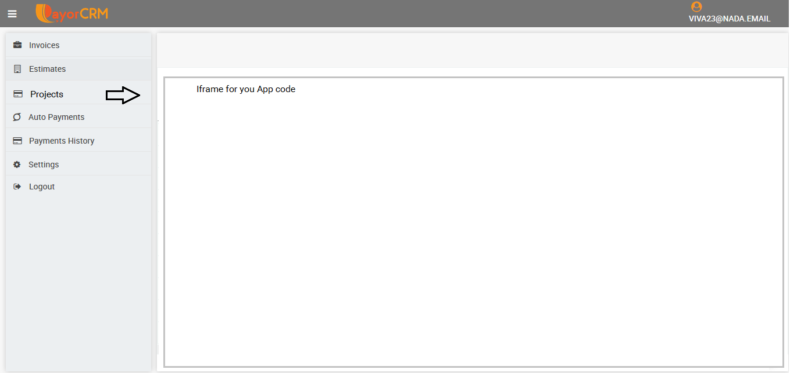

# Adding Custom App within your Customer portal

Businesses sometime would need the option to show more than just invoices to their customers in the customer portal.

PayorCRM allows you to develop your own app that can be made visible from within the customer portal.

For eg : In the below screenshot you can see that a new "Projects" menu has been added to the customer portal for your business

Clicking on the "Projects" menu will open a custom View showing all the projects related to that customer

Please reach out to our solutions team - solutions@payorcrm.com to know more about how your business can implement such custom apps within the customer portal.

