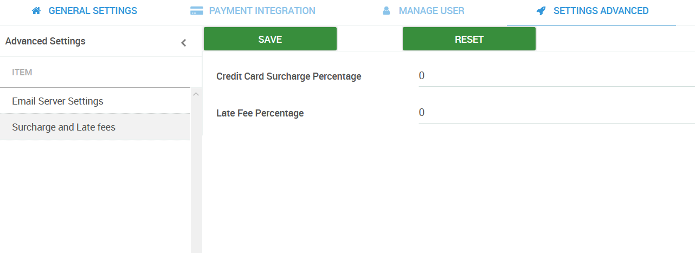

# Credit Card surcharge and Late fees

PayorCRM allows you the ability to add a  credit card surcharge if a customer pays using his credit card or to add a late fee if the customer pays the invoice after the due date.

**Credit Card Surcharge Percentage** This field allows you to provide a credit card surcharge as a percentage\(For eg : If you would like to charge a 2.75% surcharge , you can provide the value 2.75 in this field\)

**Late Fee Percentage** This field allows to provide a late fee as a percentage \( For eg : If you would like to charge a late fee of 1% , you may provide the value 1 in this field \)

