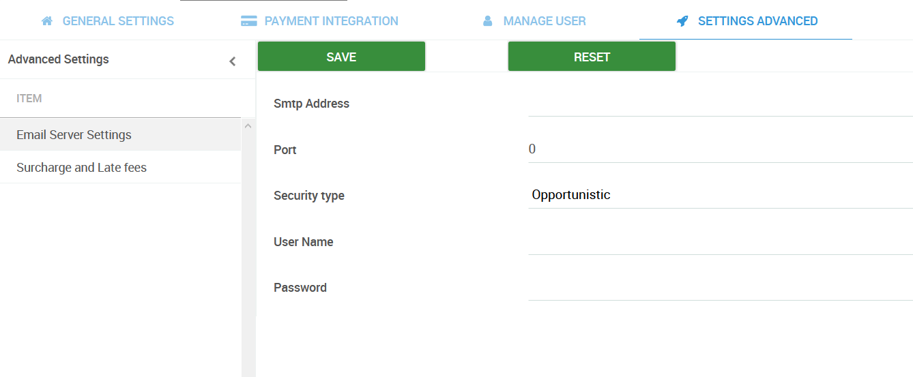

# Using your own Email Server

PayorCRM gives you the ability to use your own email server to send emails.The app can connect to your email server via its SMTP service

The following list provides the various configuration parameters to enable this feature&#x20;

* **Port** – is the port to connect to ( usual values are 587 , 465 , 25)
* **SMTP Address**– is the hostname or IP address to connect to&#x20;
* **User** is the username
* **Password** is the password for the user
*   **Security type** if "Always On" the connection will use TLS when connecting to server. If "Opportunistic"  then TLS is used if server supports the STARTTLS extension. In most cases set this value to "Always On" if you are connecting to port 465. For port 587 or 25 keep it "Opportunistic"

