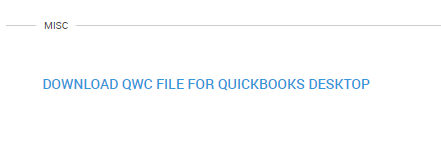
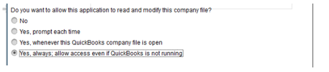
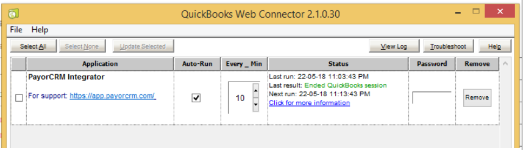
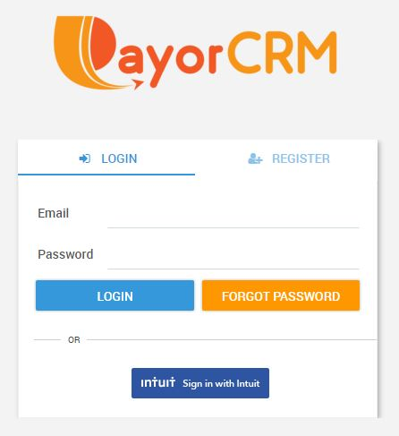

# Connecting to QB Desktop/Online

PayorCRM application can connect to both QuickBooks Desktop or QuickBooks Online to pull data from these accounting systems.If you are using an accounting software different from QuickBooks , Reach out to us at solutions@payorcrm.com

## Connecting to QuickBooks Desktop

To be able to connect to QuickBooks Desktop you may need to complete the following steps

1. Create an account using the registration screen at [https://app.payorcrm.com/](https://app.payorcrm.com/#!/login)
2. After filling the form click on the Register button and then Login to the portal
3. Click "Settings" menu on the left pane
4. Under "General settings" tab click on the "Download QWC file" button to download the connector file required for Desktop connection

6.Open QuickBooks Desktop and follow the below steps

* Go to File -&gt; Update Webservices
* Click on "Add an application" button and select the qwc file you had downloaded from the portal \(step 4\)
* In the next screen that appears you would need to select the radio button as shown in the pic below to ensure your data is updated on the PayorCRM portal

* On the below screen, click on the password field and add the same password you had used to create your account on payorCRM
* Click on the button "Update selected"\(top-left\) after selecting "PayorCRM Integrator" to refresh the data on PayorCRM portal

* Login to PayorCRM  to check if all your data\(invoices and customers\) is visible on the portal.Refresh the page in case you are not able to see the data

## Connecting to QuickBooks Online

1. Click on "Login with QuickBooks" .This will take you to the QuickBooks login page for authentication.
2. Enter your QuickBooks credentials and click submit
3. In the next screen you may be asked to provide authorisation to sync data with PayorCRM
4. Click on "Authorise"
5. You will automatically be taken to the PayorCRM dashboard screen

