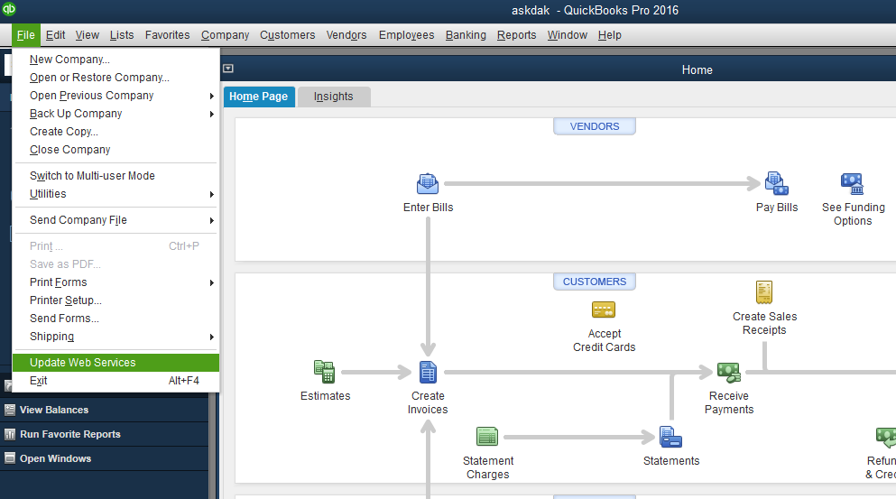

# QuickBooks Desktop

## Connecting to QuickBooks Desktop

To be able to connect to QuickBooks Desktop you may need to complete the following steps

* To create an account with us that can be linked to your QB Desktop account , Please reach out to us by using the the link [https://www.payorcrm.com/pricing/](https://www.payorcrm.com/pricing/)

Once an account has been created by us, Follow the below steps to sync data to the application

* Click the "Settings" menu on the left pane after logging in
* Under the "General settings" tab click on the "Download QWC file" button to download the connector file required for Desktop connection

5.Open QuickBooks Desktop and Go to File -> Update Webservices

* Click on the "Add an application" button and select the qwc file you had downloaded from the portal&#x20;

* In the next screen that appears you would need to select the radio button as shown in the pic below to ensure your data is updated on the PayorCRM portal

* On the below screen, click on the password field and add the same password you had used to create your account on PayorCRM

* Click on the button "Update selected"(top-left) after selecting "PayorCRM Integrator" to refresh the data on PayorCRM portal

* Login to PayorCRM to check if all your data(invoices and customers) are visible on the portal.Refresh the page in case you are not able to see the data after waiting for 5 - 10 min
