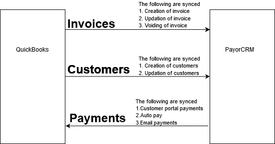

# Data sync


Deletion of invoices are not synced . We recommend either of the below approaches in-case you would like to delete an invoice

1. Void the invoice on QB . Ensure that the invoice is voided on PayorCRM by initiating a manual sync and then delete the invoice on QB
2. Delete the invoice on QB . On PayorCRM go to "Invoices view" \(Auto-collect\) - Select invoices you would like to Void - Click on "More" - "Void invoices"


