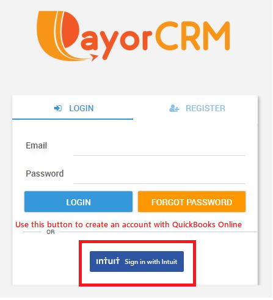

# QuickBooks Online

1. Click on "Sign in with Intuit" .This will take you to the QuickBooks login page for authentication.
2. Enter your QuickBooks credentials and click submit
3. In the next screen, you may be asked to provide authorization to sync data with PayorCRM
4. Click on "Authorize"
5. You will automatically be taken to the PayorCRM dashboard screen

