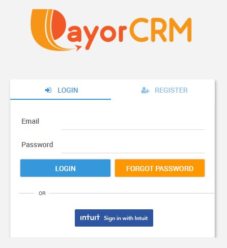

# QuickBooks Online

1. Click on "Login with QuickBooks" .This will take you to the QuickBooks login page for authentication.
2. Enter your QuickBooks credentials and click submit
3. In the next screen, you may be asked to provide authorisation to sync data with PayorCRM
4. Click on "Authorise"
5. You will automatically be taken to the PayorCRM dashboard screen

