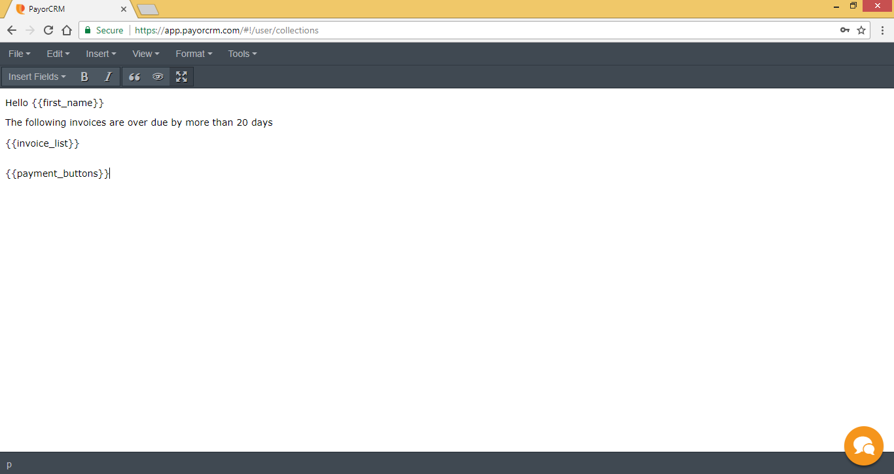
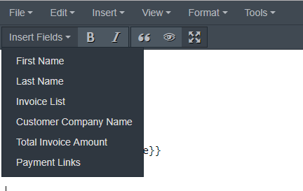

# Customising email templates

PayorCRM provides absalute flexibility to customise your emails

Click on  so that the email template editor screen covers the page. Click on the same button after completion of customisation of the email template

## Add dynamic fields as required

Email template editor allows you to add dynamic templates that are replaced with autogenerated content before the email is sent

PayorCRM supports the following dynamic fields

* First name - The first name as defined in your customer list
* Last name - The last name as defined in your customer list
* Invoice list - List of unpaid invoices that are defined in the email rules section
* Customer Company Name - Company name as defined in the Customer list
* Total amount  - Total due amount 
* Payment buttons - Payment buttons that will help your customer pay you right within the email .See details here - [https://help.payorcrm.com/how-customers-pay.html](https://help.payorcrm.com/how-customers-pay.html)

You can add the dynamic fields at any given location in the mail template body by selecting them from the drop down "Insert Fields" as shown below

## Advanced customisation

You can also customise your email template using an external editor as shown below.In the below video we have used [https://demo.stripo.email/](https://demo.stripo.email/) although there are many free external editors available.A simple google search would provide many such editors.

Once you create a template you like , you can copy the html code of the template and paste it within the html editor as shown

