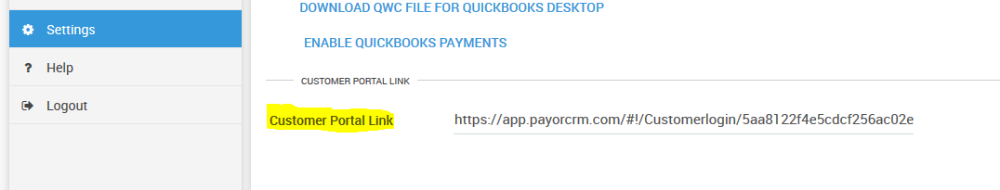

# Branded Customer portal

****

You can get your Customer portal login link from **settings -> General Settings** as shown in the image below

Add the customer portal link on your website as shown below.&#x20;

Sample branded customer portal login link - [Click here](https://app.payorcrm.com/#!/Customerlogin/5aa8122f4e5cdcf256ac02ef)

.png>)


To ensure that your logo appears on the customer portal you will need to upload your company logo by going to Profile(top right button) - Upload logo


