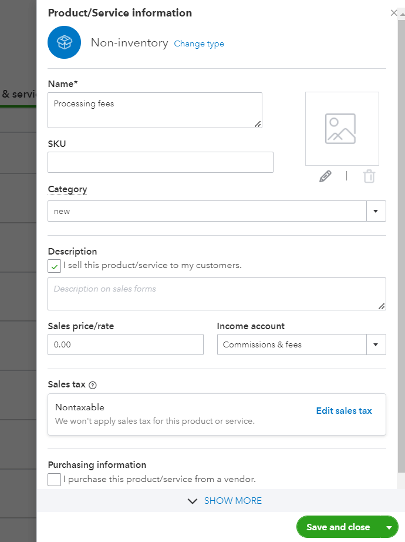

# Allowing Customer Portal access from your Website

Allowing your customers to come to your website to access the invoices raised by you and pay them at their convenience is a feature any business with more than 20 customers would need.

With PayorCRM you can achieve the same by following any of the given option below

**Simple Login Button**

Add a login button on your website which upon clicking will redirect the user to the payorCRM login page. They can login and acess all their invoices due and pay them right away. 

