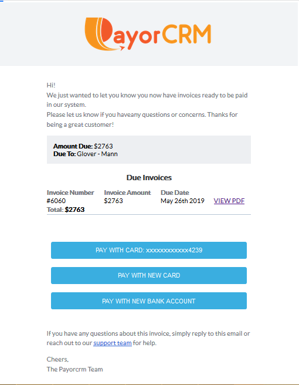
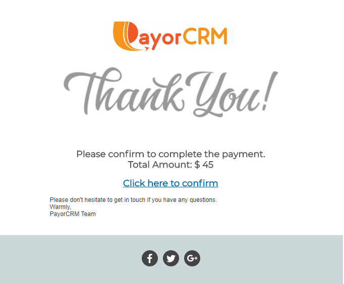
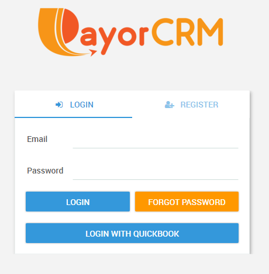
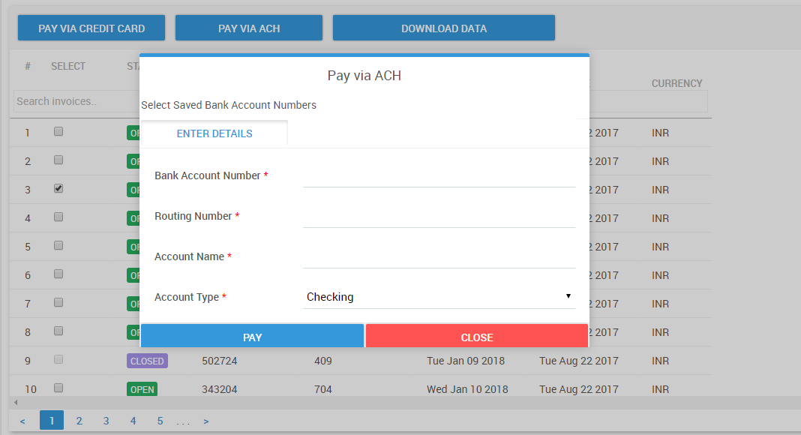
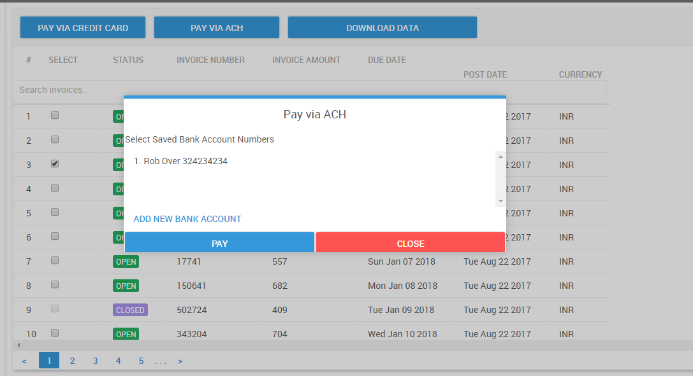
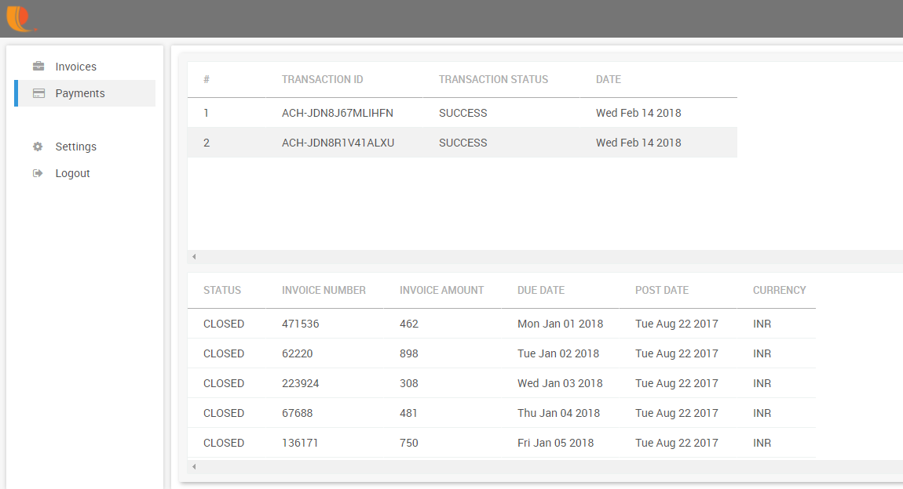

# How customers pay you

This guide will show you various ways your customers can pay you through the payorCRM product

## From their email inbox

Yes ! Your customers can now pay you right from their email inbox using their previously saved cards or bank account numbers

When a customer receives the email with list of overdue invoices, It will look like below

Clicking on the "Pay with card xxxxx" will trigger a confirmation email to be sent to the customer email as shown below

Clicking on the confirmation link will complete the payment and they can do all this right from their inbox for all their overdue invoices together !!

## Through Customer login

All the customers in your customer list will receive an email invitation with the password.

They can use the received credentials to login to their portal and view all their unpaid invoices and payments history.

If a customer has not received the email with credentials ,They can directly reset the password using the "Forgot password" link in the login page

Once the customer logs in they can make payments for invoice raised by you through the following ways

1. Pay using credit card

2.Pay using US ACH \( by entering US Bank account and routing numbers\)

3.Pay using previously saved Bank account number using US ACH payment method

Once payments are made the paid invoices will appear in the payment transactions view for both you and your customers as shown below

