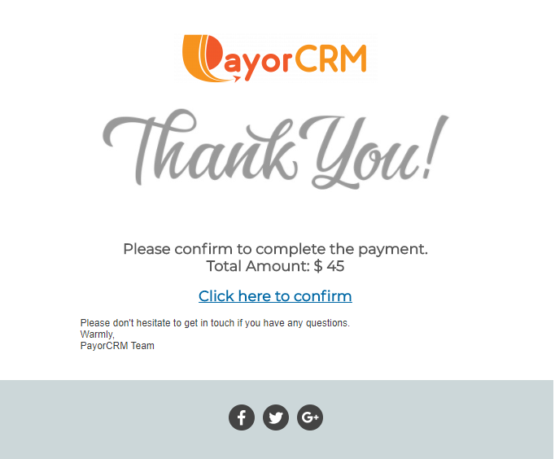

# From within email using saved card/bank acct

When a customer receives a payment reminder with list of overdue invoices, It will look like below

Clicking on the "Pay with card xxxxx" will trigger a confirmation email to the customer's email id as shown below

Clicking on the confirmation link will complete the payment.

