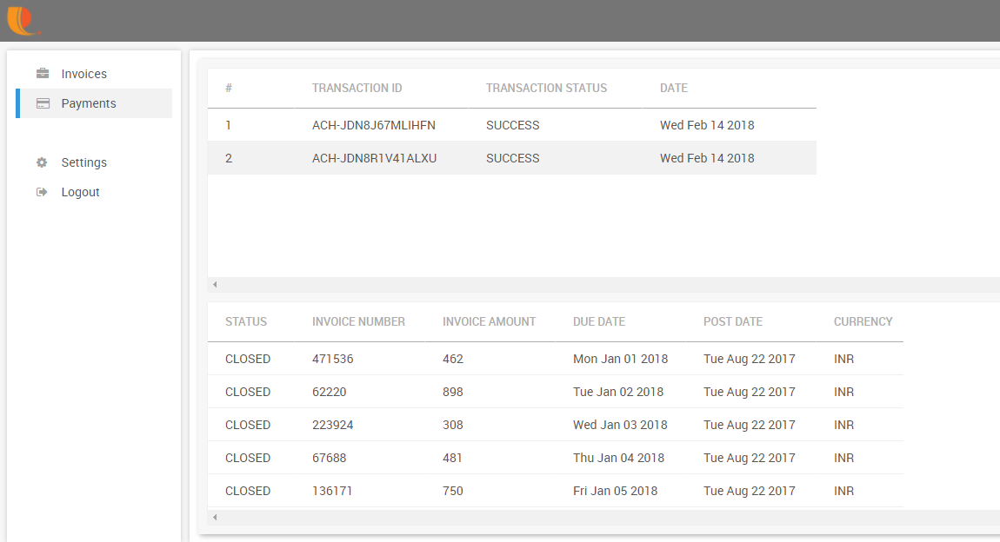

# Through Customer login

Once the customer logs in they can make payments for invoice raised by you through the following ways

1.Pay using New Credit Card or a previously Saved Card

2.Pay using Bank account no \( In case of US, A US Bank Account Number and Routing Number\) or using a previously Saved Bank Account Number 

Once the payments are made the paid invoices will appear in the payment transactions view for both you and your customers as shown below

