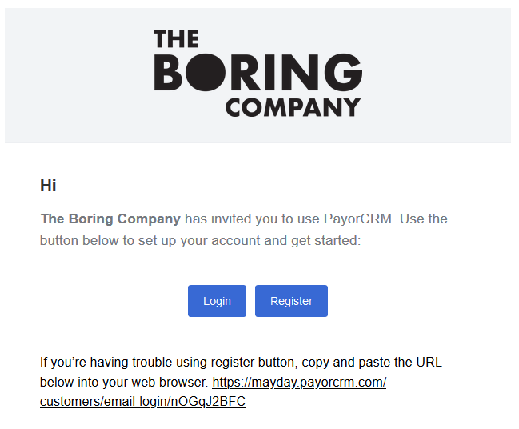

# Inviting customers to your Billing portal

To allow your customers to login to your billing portal and view invoices/pay invoices , You will need to first invite them .There are two ways to invite customers.

1 . [Inviting customers automatically](https://help.payorcrm.com/inviting-customers-to-the-portal/inviting-customers-automatically)

2 . [Inviting customers manually](https://help.payorcrm.com/inviting-customers-to-the-portal/steps-to-invite-customers)

