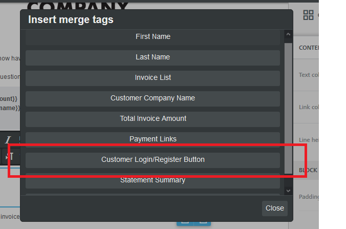
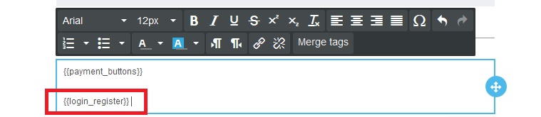
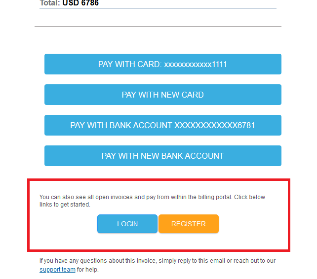

# Inviting customers automatically

You can automatically invite customers by sending them an invite link along with automated invoice reminders

To add an invite link to invoice reminders&#x20;

1. Go to **Invoice Reminders - > Email Templates**

.png>)

2\. Click on **Edit email template**

.png>)

3\. Click on the button **Merge tag **

4\. Select **Customer login/Register button**

5\. The merge tag to add Login/Register button will be added as below

6\. When the customer receives the email reminder they will see the below buttons to Login/Register

