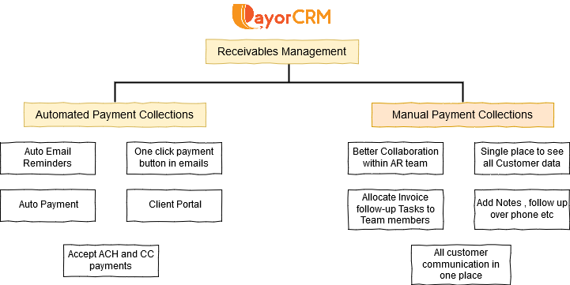

# Manual Collections

**Auto Collections Vs Manual Collections**

**Auto Collections** - This module is meant for businesses that needs an automated system to follow up customers to get payments as well as automate incoming payment acceptance

**Manual Collections** - This module is meant for businesses that follows a manual process \(read phone calls, personal emails etc \) to follow up customers and needs to streamline the process with a tool.

