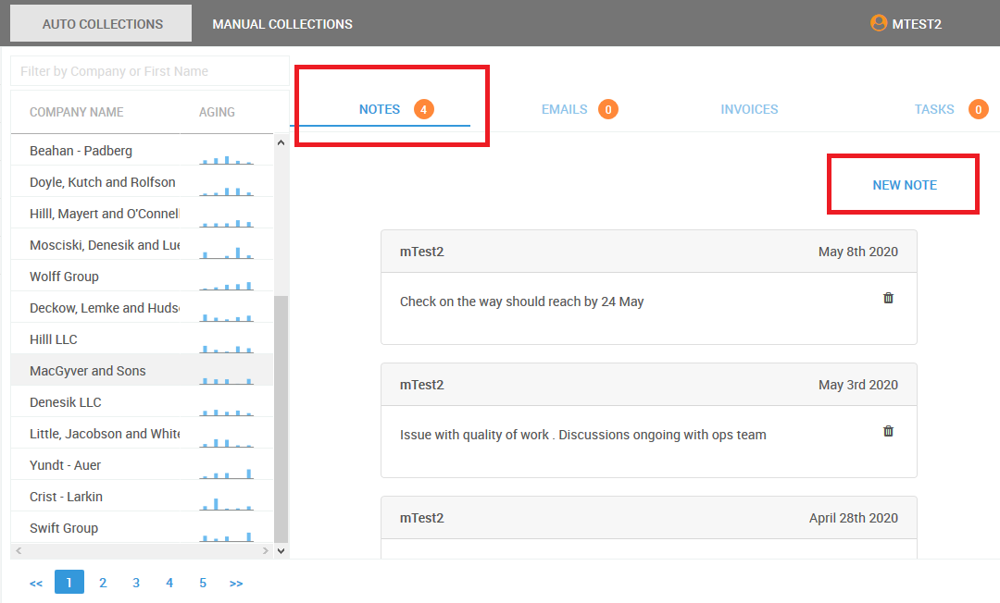

# Adding Collection Notes

The below steps shows how to add collection notes against a customer so that you and your team can collaborate better when following up customers for payments

1. Go to Manual Collect module

  2. Select the Customer you would like to add notes against or search for the customer you would like to add notes against

3. Click on Notes tab to view / add notes

Note : At the end of the day all the notes added on that particular day are sent to email addresses of all users within your company who has access to the application

