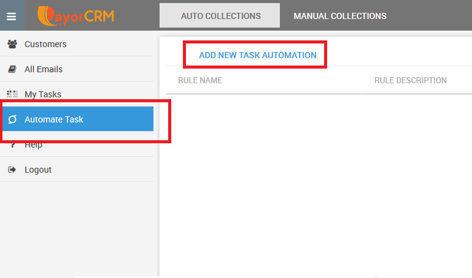

# Allocating follow up tasks automatically

You can allocate follow up tasks to your team members automatically based on certain triggers

Examples of automated follow up tasks&#x20;

1. Create a task to follow up invoices 5 days overdue
2. Create a task to follow up invoices 10 days overdue and greater than $ 1000

**Step 1 :** Go to Manual collect module - Automate task - Add New Task Automation

**Step 2 : **Provide a "task title" and the "description of the task" along with whom to allocate the task to

.png>)

**Step 3 : Examples of commonly used rule triggers**

* Rule to automatically create task for invoices (all customers) due in 3 days

.png>)

* Rule to automatically create task for invoices (customer category- "slow paying customers") and overdue by 5 or 10 days

