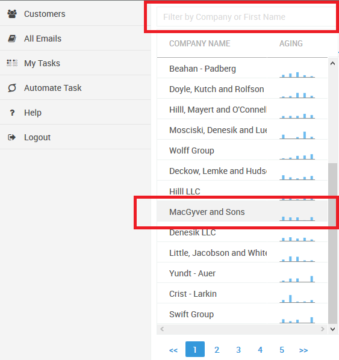
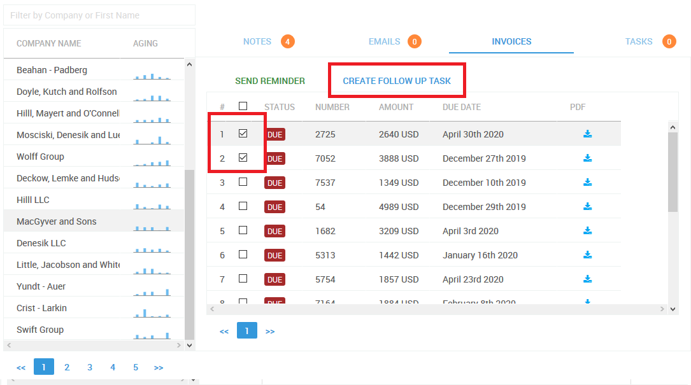
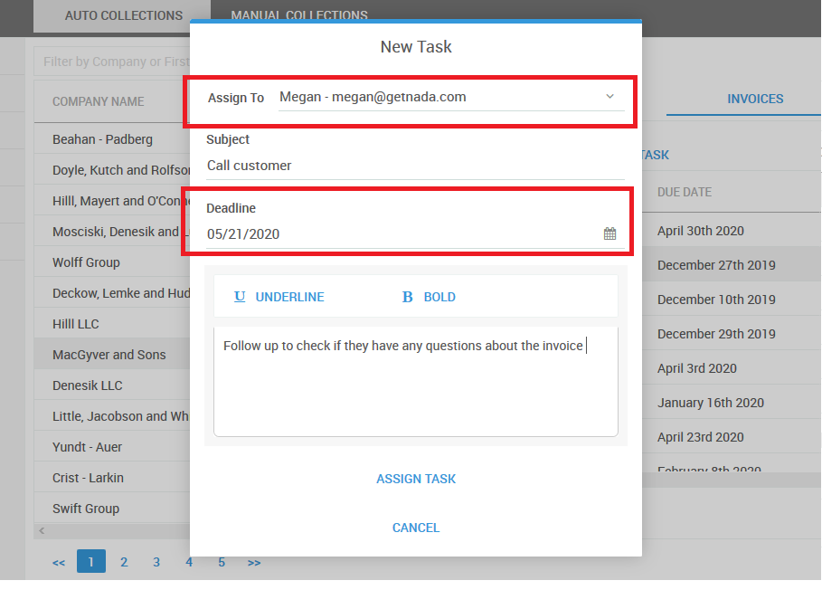
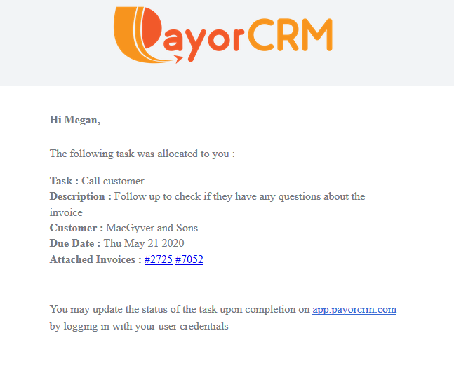

# Allocate follow up tasks manually

You can allocate follow up tasks to your team members as below

Step 1 : Go to Manual collect module - Select the customer who needs to be followed up 

Step 2 : Select a few invoices for which the follow up task is being created and click on "Create Follow up Task" button

Step 3 : Select the user to allocate the task to along with a "Task Title" and "Description" in the "Create Task" popup as below

On the day the task is due the user will receive a Task reminder email as below with invoices attached

