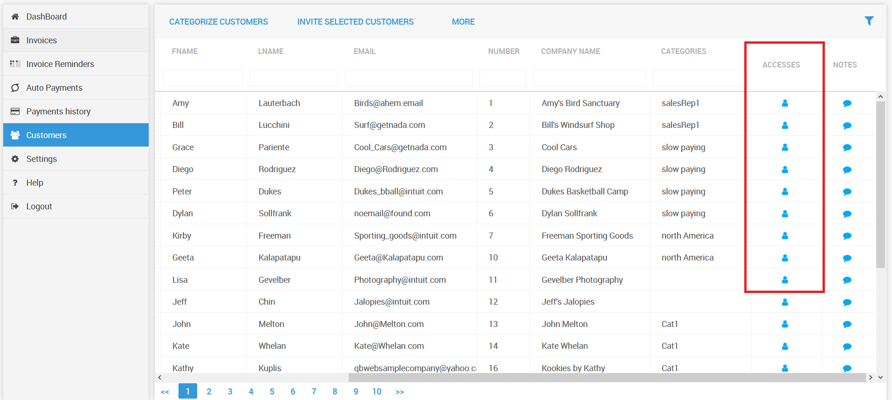

# Managing customer access

This section describes how you will be able to manage your customer users who have access to the customer portal

## Viewing customers users who have access to the customer portal

Go to the Customers Menu - &gt; Click on the Accesses button against each customer to see the users who have access to a particular customer

In the below screenshot you can see all the users who have access to the customer portal for a particular customer.

 You can also delete users for whom you would like the access to be removed by clicking on the delete button

