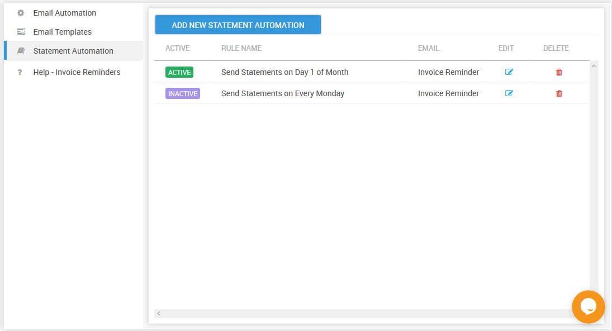

# Enabling Default Statement Automation Rules

When you create an account on PayorCRM . The app creates a set of default automation rules which can be activated by just one click

To activate them

1. Click on "Invoice reminders" in the menu on the left and select "Statement Automation"
2. Click on the "Active" / "Inactive" toggle button to activate
3. Voila ! PayorCRM will send statements automatically to all your customers based on either the first day of the month or every monday depending on the rule activated

