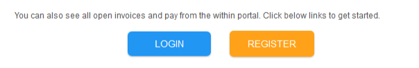

# Statement template

**Supported dynamic fields - Statement automation**

****

```
{{first_name}} 
{{customer_company_name}} 
{{total_invoice_amount}} 
{{login_register}} 
{{statement_summary}} 

```

**Total invoice amount** - The total invoice amount in the statement pdf will be added in place of this dynamic variable

**Customer company name** - The company name as provided in the customer table will be added to the statement email in place of this dynamic variable

**Login register** - The login register button to register or login to the portal will be added in place of this dynamic variable



**Statement summary** - The following summary will be added in place of this dynamic variable



Please note that the below 2 dynamic fields are not supported in a statement reminder email . They will be replaced by blanks if added to a statement automation email template

```
{{payment_buttons}}
{{invoice_list}}
```

