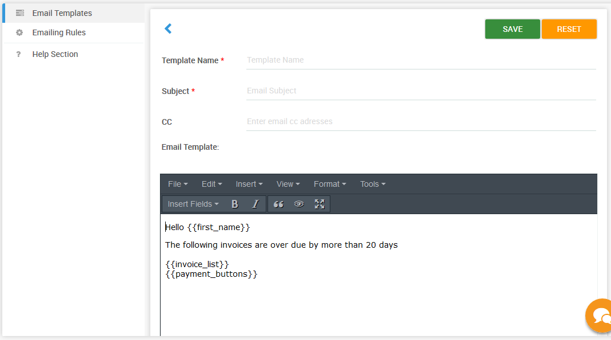
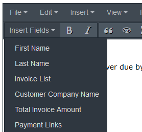
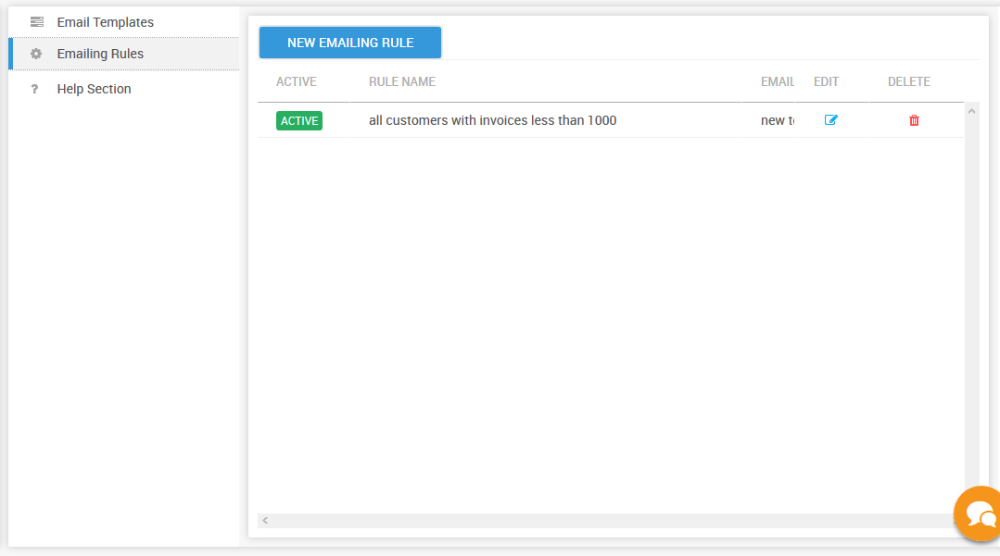
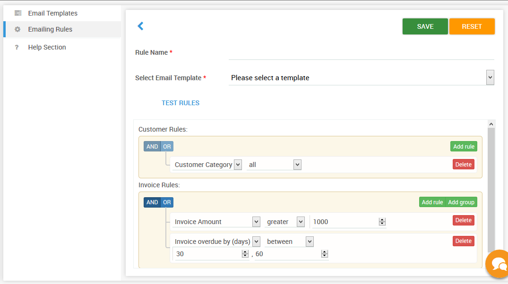

# Creating Custom Email Automation

## Create Custom Email Automation with Custom Email templates \( Advanced setup \)

The steps involved are as follows

1. Create an email template with a message content based on the rule you will set.
2. Create Emailing rules
3. Save rule 
4. Repeat for a different set of email template and rules

## Step 1 : Create an email template

Initially you will have to come up with the mail template for each of the type of reminders.

_Click on create a new template where you could define your template look and feel and text content.This opens up the following window_

Provide a template name , Subject of the email , CC \( optional\) along with the body of the mail.

Use Insert fields drop down to add various dynamic variables within the email.Make sure you add the variable field .  defines the position where the table with the list of invoices would go .

Adding  in the mail body will ensure that payment links are added to the email body when the customer receives the message so that customer can pay from within the email.

Note : You will need to ensure that you have set up payments on PayorCRM before using Payment links \(Check the help section "Setting up payments" on how to setup payments \)

## Step 2 : Create and Define the rule

The rules define which customers will receive the emails and invoices will be send in the reminder email along with the email template to be used while sending the email

PayorCRM runs through the rules every day to check if there are any Customers and invoices matching the rule on a particular day.If there is a match , The customer defined in the rule would then receive a mail with all the invoices matching the rule

Click on "New Emailing Rule"

Customer rules section allows you to specify which customer \(using customer number\) or group of customers \(using customer categories\) would receive the mail

Invoice rules section allows you to specify which invoices of the above selected customer needs to be sent in the reminder email.

Some common invoice rules  
1. Invoice amount greater/less than xxxx  
2. Invoice overdue days in the bucket 30-60 days  
3. invoice due in 1 day

_Email rules to define the rules based on which the email will be sent_

### Example

In the above example as you can see the rule says that PayorCRM needs to send all customers who has invoices with Invoice amount greater than 1000 and is in the 30 to 60 days overdue bucket.

_Test rules_

Click on the test rule button to test the rule with the invoices you have currently loaded on PayorCRM.This will open up a popup with the results of the rule as of today.

Once you are satisfied with the rule , You can click on save button to save the rule.

