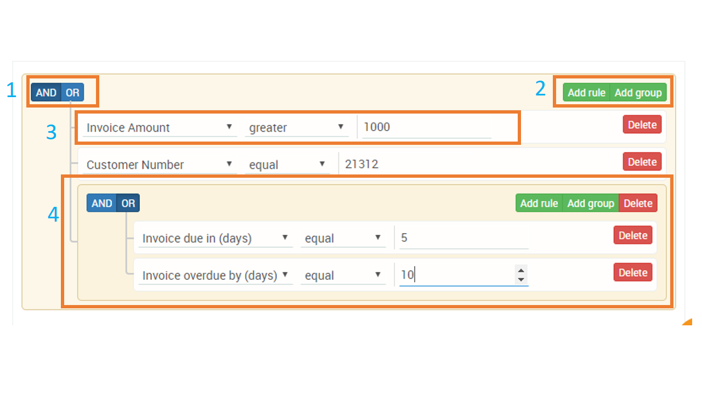

# Creating Advanced Rules

The rule creator under Invoice reminder allows advanced rules to be created based on business need .The below guide will help users create advanced rules 

The below screenshot shows the UI of the rule creator view

**AND / OR operator \(1\)** - The 'AND' , 'OR" operator defines whether you wants the rules to be  AND'ed or OR'ed

**Add Rule / Add Group \(2\)**

Add rule - Adds a single rule \( for eg: Invoice overdue by 10 days\)

Add group - Allows you to add a rule group

**A Single Rule \(3\)** 

Item 3 shows an example of a rule added in the rule creater \( invoice amount greater than 1000\)

**A Rule group \(4\)**

Item 4 shows an example of rule group \( invoice due in 5 days OR Invoice overdue by 10 days \)

### 

