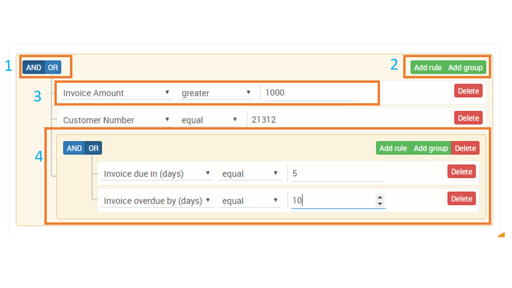

# Creating Advanced Rules

The rule creator under Invoice reminder allows advanced rules to be created .The below guide will help advanced users create advanced rules when creating custom reminders.



1. AND / OR operator - The 'AND' , 'OR" buttons allows you to define whether the individual rules or the individual groups would be AND ed or OR ed .In the above screenshot the rule will be run only if Invoice amount is greater than 1000 AND Customer Number is equal to 21312 AND the Rule group provides the result as True
2. Add Rule / Add Group -

   ```text
      The 'Add rule ' button allows you to specify a single rule .
   ```

   The invoice number should be greater than 1000 is a single rule defined in the above screenshot

   ```text
   The 'Add group' button allows you to add a new Rule group which can contain multiple rules within itself
   ```

   1. The Rule definition - The moment you click on 'Add rule' button a new empty rule definition line is added.This is where you could add a new rule that rules engine need to consider.You can add literally infinite number of such rule definitions.
   2. The Rule group - A rule group allows you to add a group of rule definitions which can be AND ed or OR ed seperate from the other rules

In the above example the above rule gets triggered when either the invoice due days equals 5 days or when the Invoice is over due by 10 days .The rule group will provide the result TRUE only when either of these are true.

### Adding a category

To add a new category you'll need to go to [Customers View](https://app.payorcrm.com/#!/user/customers) and click on the edit button. A popup with select customer details will popup and you'll see a button saying `NEW CATEGORY` click on this button to add new category.

