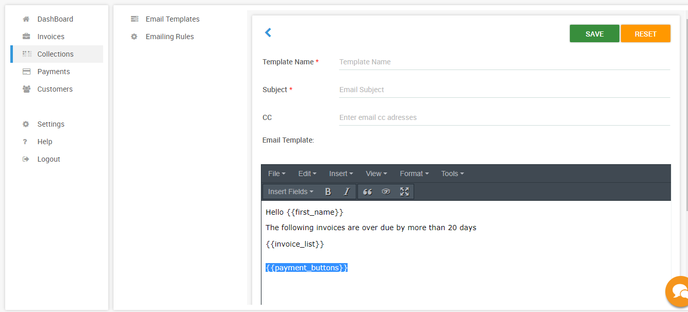
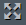
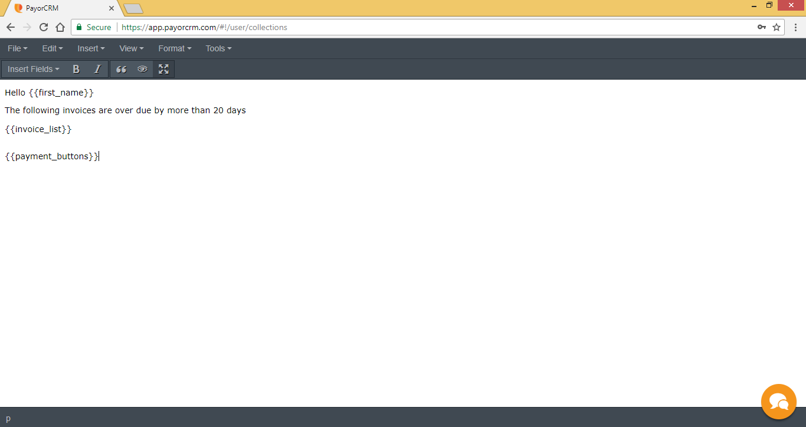
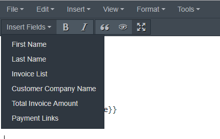

# Customising email templates

PayorCRM provides absolute flexibility to customize your emails using the email template editor.

Click on  to let the email template editor screen cover the page. Click on the same button after completion of customization of the email template to minimize the same.

## Add dynamic fields as required

Email template editor allows you to add dynamic templates that are replaced with auto-generated content before the email is sent.

PayorCRM supports the following dynamic fields

* First name - The first name as defined in your customer list
* Last name - The last name as defined in your customer list
* Invoice list - List of unpaid invoices that are defined in the email rules section
* Customer Company Name - Company name as defined in the Customer list
* Total amount  - Total due amount 
* Payment buttons - Payment buttons that will help your customer pay you right within the email .See details here - [https://help.payorcrm.com/how-customers-pay.html](https://help.payorcrm.com/how-customers-pay.html)

You can add the dynamic fields at any given location in the mail template body by selecting them from the drop down "Insert Fields" as shown below

## Advanced customization

You can also customize your email template using an external editor as shown below.In the below video we have used [https://demo.stripo.email/](https://demo.stripo.email/) although there are many free external editors available.A simple google search would provide many such editors.

{% embed data="{\"url\":\"https://www.youtube.com/watch?v=F8CZ0jRk2PI\",\"type\":\"video\",\"title\":\"Using an external email editor to create an email template in PayorCRM.com\",\"description\":\"www.payorcrm.com\",\"icon\":{\"type\":\"icon\",\"url\":\"https://www.youtube.com/yts/img/favicon\_144-vfliLAfaB.png\",\"width\":144,\"height\":144,\"aspectRatio\":1},\"thumbnail\":{\"type\":\"thumbnail\",\"url\":\"https://i.ytimg.com/vi/F8CZ0jRk2PI/maxresdefault.jpg\",\"width\":1280,\"height\":720,\"aspectRatio\":0.5625},\"embed\":{\"type\":\"player\",\"url\":\"https://www.youtube.com/embed/F8CZ0jRk2PI?rel=0&showinfo=0\",\"html\":\"
<iframe src=\\\"https://www.youtube.com/embed/F8CZ0jRk2PI?rel=0&amp;showinfo=0\\\" style=\\\"border: 0; top: 0; left: 0; width: 100%; height: 100%; position: absolute;\\\" allowfullscreen scrolling=\\\"no\\\"></iframe>
\",\"aspectRatio\":1.7778}}" %}

Once you create a template you like , you can copy the html code of the template and paste it within the html editor as shown \(Tools -&gt; Source code \)

Click ok once you paste the Html code within the editor

