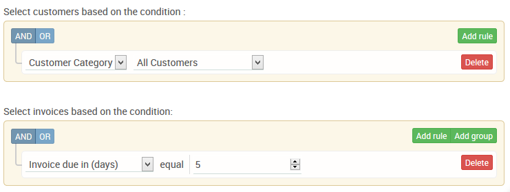
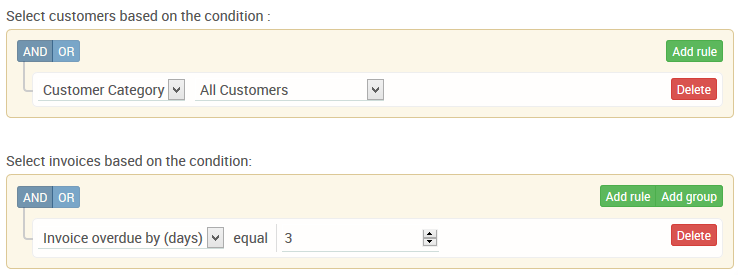
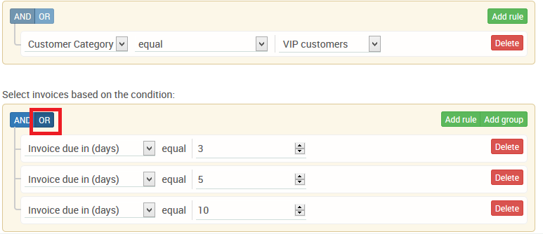
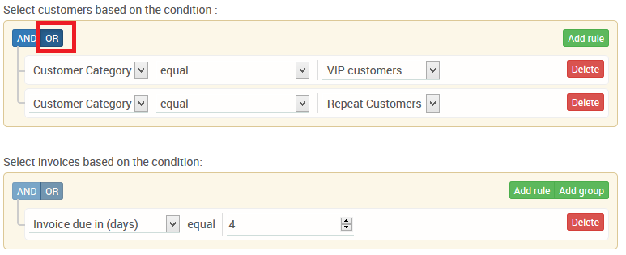

# Examples of Email reminder rules

#### 1. **Invoice reminder rule to send all invoices due in 5 days to respective customers \[ Applies to all customers \]**

### 

#### 2. Invoice reminder rule to send all invoices overdue by 3 days to respective customers **\[ Applies to all customers \]**

### 

#### 3. Invoice reminder rule to send all invoices overdue by 3 days or 5 days or 10 days  to respective customers **\[ Applies to all customers \]**

### 

#### 4. Invoice reminder rule to send all invoices due in 1 day to customers of the category "VIP customers" **\[ Applies to VIP customers \]**

### 

#### 5. Invoice reminder rule to send all invoices due in 4 days to customers of the category "VIP customers"  or "Repeat customer" **\[ Applies to VIP customers / Repeat customers \]**

If you need help with setting up a rule different from the above , Please reach out to us on solutions@payorCRM.com and we will send you a sample screenshot as above

