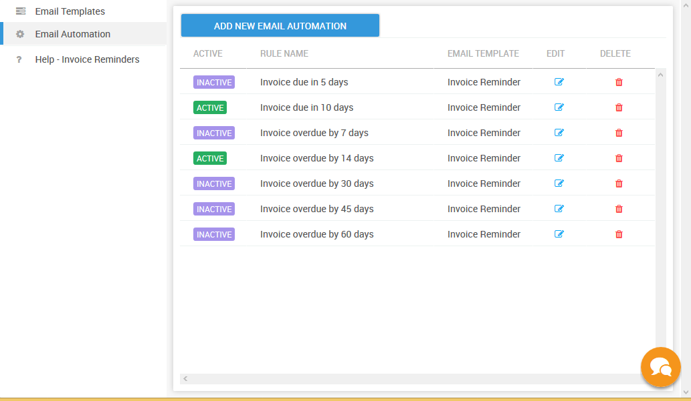

# Using the default Email Automation \( one click setup \)

When you create an account on PayorCRM . The app creates a set of email automation which can be activated by just one click

To activate them

1. Click on "Invoice reminders" in the menu on the left and select "Email Automation"
2. Click on the "Active" / "Inactive" toggle button to activate
3. Voila ! PayorCRM will send email reminders automatically to all your customers based on Invoice due /overdue days

