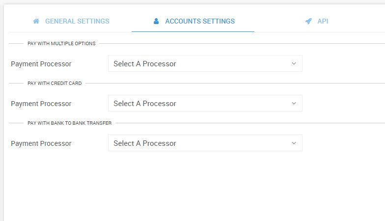

# Setting up payments

To setup payments do the following steps

* Click on the settings button in the menu

* Select Account settings from the tab

* You can see three different methods through which a customer of yours can pay you
  * Pay by Multiple
  * Pay by Credit card
  * Pay using Bank to Bank transfer methods

