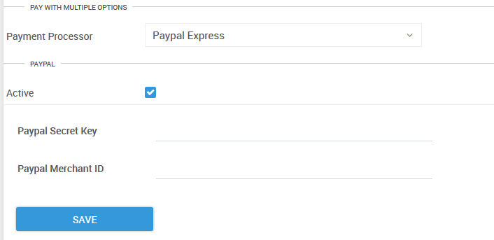

# Setting up PayPal

You will need to create an app in the PayPal account to generate a client ID for your account. 

* Go to the developer PayPal website and create an account or sign in.
* After Sign In, go to [https://developer.paypal.com/developer/applications/](https://developer.paypal.com/developer/applications/) My Apps & Credentials and click “Create App” button to create an application. Fill in the necessary details and select Create App.

* Once the App is created it will have a toggle for sandbox and live .

* Switch the toggle to Live.

On PayorCRM app go to Settings \(left menu\) - Payment Integration

* The client id value from PayPal should be filled in the "PayPal Merchant id" field on the app \(see screenshot below\)
* The secret key value will have to be filled in the "PayPal secret key" field on the app


Please note that customers can pay using PayPal only by logging into the customer portal and not via email reminders.


